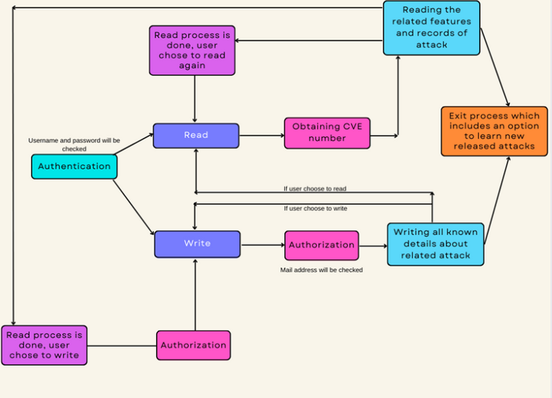

[![Contributors][contributors-shield]][contributors-url]
[![Forks][forks-shield]][forks-url]
[![Stargazers][stars-shield]][stars-url]
[![Issues][issues-shield]][issues-url]
[![MIT License][license-shield]][license-url]
[![LinkedIn][linkedin-shield]][linkedin-url]

<!-- PROJECT LOGO -->
 

  

<h3 align="center">ATVCFEPK </h3>

  

     The ATVCFEPK project, developed by SentSecPro, is a database system that manages the company's past vulnerabilities and attacks. Authorized personnel can access detailed information via CVE numbers and also receive information about newly disclosed public attacks. However, it lacks features for recovering forgotten login credentials or tracking user activity. While the system fulfills its purpose of providing information about vulnerabilities and attacks, there are opportunities for improvement.
     
    <a href="https://github.com/senabibi/Atvcfepk"><strong>Explore the docs »</strong></a>
     
     
    <a href="https://github.com/senabibi/Atvcfepk">View Demo</a>
    ·
    <a href="https://github.com/senabibi/Atvcfepk/issues">Report Bug</a>
    ·
    <a href="https://github.com/senabibi/Atvcfepk/issues">Request Feature</a>
  

<!-- TABLE OF CONTENTS -->

  
Table of Contents

  <ol>
    <li>
      <a href="#about-the-project">About The Project</a>
      <ul>
        <li><a href="#built-with">Built With</a></li>
      </ul>
    </li>
    <li>
      <a href="#getting-started">Getting Started</a>
      <ul>
        <li><a href="#prerequisites">Prerequisites</a></li>
        <li><a href="#installation">Installation</a></li>
      </ul>
    </li>
    <li><a href="#usage">Usage</a></li>
    <li><a href="#roadmap">Roadmap</a></li>
    <li><a href="#contributing">Contributing</a></li>
    <li><a href="#license">License</a></li>
    <li><a href="#contact">Contact</a></li>
    <li><a href="#acknowledgments">Acknowledgments</a></li>
  </ol>

## About The Project

  

The ATVCFEPK project, developed using C++ by SentSecPro, is a substantial and innovative venture that addresses the ever-growing importance of cybersecurity. This project serves as a comprehensive Corporate Vulnerability Management System, meticulously designed to manage the company's historical vulnerabilities and attacks. It offers authorized personnel access to in-depth information through the use of CVE numbers, while also providing insights into newly disclosed public attacks.

In this system, data is organized and stored efficiently, enabling a structured approach to understanding and addressing vulnerabilities and cyber threats. The project's architecture leverages the principles of Object-Oriented Programming (OOP) for enhanced code organization, modularity, and maintainability. With its sophisticated design, it aids in safeguarding critical information assets.

While the project excels in delivering valuable insights about past vulnerabilities and attacks, it acknowledges the potential for enhancement in terms of features such as password recovery and user activity tracking. Despite these opportunities for improvement, the Corporate Vulnerability Management System within the ATVCFEPK project remains a valuable tool for managing and safeguarding data in an increasingly challenging cyber landscape.

This project, with its focus on cybersecurity and its utilization of OOP principles, embodies a commitment to enhancing corporate security in an age where cyber threats continue to evolve and pose a significant risk.

(<a href="#readme-top">back to top</a>)

### Built With

* [![C++.cpp][cpp-icon]][CPP-url]
* [![Snyk][Snyk.com]][Snyk-url]
* [![Spring_Security][Spring_Security.com]][Spring_Security-url]
* [![Vısual Studio Code][vsc.com]][VSC-url]
* [![BRAVE][brave.com]][BRAVE-url]

(<a href="#readme-top">back to top</a>)

## Getting Started

This section provides instructions on how to set up and run the project locally. Please follow these steps to get your environment ready.

### Prerequisites

Before you start with the C++ and OOP Security Attacks project, make sure you have the following prerequisites in place:

* [C++ Compiler](https://cpp.sh/): You'll need a C++ compiler installed on your system to compile and run the C++ code used in this project. If you don't have one, you can install a compiler like g++ or Visual C++.

* [Object-Oriented Programming (OOP) Knowledge](https://www.w3schools.com/cpp/cpp_oop.asp): Familiarity with Object-Oriented Programming concepts is essential for understanding and working with the code. Make sure you have a good grasp of OOP principles.

* [Security Basics](https://www.cdse.edu/Training/eLearning/IS122/): A fundamental understanding of cybersecurity and common security threats is crucial. Ensure you have a basic knowledge of security concepts to effectively address security attacks.

* Code Editor/IDE: Choose a code editor or integrated development environment (IDE) that you're comfortable with for writing and running C++ code. Popular options include Visual Studio Code, CLion, or Code::Blocks.

* Libraries and Dependencies: Depending on the specific security attacks you plan to study, you may need additional libraries and dependencies. Be prepared to install and configure these components as needed.

* Sample Data: If your project involves analyzing security attack data, make sure you have access to relevant datasets or sample data files.

Having these prerequisites in place will ensure a smooth and productive experience while working on the C++ and OOP Security Attacks project, where you'll explore the world of cybersecurity through the lens of C++ and OOP.

### Installation

To set up and run the C++ and OOP Security Attacks project, please follow these steps:

1. **C++ Compiler Installation:**
   - Ensure you have a C++ compiler installed on your system. If you don't have one, you can install a compiler like g++ for Linux or MinGW for Windows.

2. **IDE or Code Editor:**
   - Choose an Integrated Development Environment (IDE) or code editor that supports C++. Options include Visual Studio Code, CLion, Code::Blocks, or any other C++-friendly environment.

3. **Project Setup:**
   - Download the project source code and related files from the project repository.

4. **Compile and Build:**
   - Open the project in your chosen IDE or code editor and compile/build the project as necessary. Ensure you follow the IDE-specific instructions for building C++ projects.

5. **Run the Project:**
   - Once the project is built successfully, run it to start exploring the world of C++ and Object-Oriented Programming in the context of security attacks.

6. **Additional Dependencies:**
   - Depending on the specific security attack scenarios you plan to investigate, you might need additional libraries or dependencies. Install and configure these components as required.

By following these steps, you can set up and run the C++ and OOP Security Attacks project. It's an excellent way to delve into the realm of cybersecurity through the lens of C++ and Object-Oriented Programming.

(<a href="#readme-top">back to top</a>)

## Usage

To run the C++ and OOP Security Attacks project and set up your environment for an interactive and educational experience, follow these steps:

1. **C++ Compiler:**
   - Ensure you have a C++ compiler installed on your system. If not, install a suitable C++ compiler like g++ for Linux or MinGW for Windows.

2. **IDE or Code Editor:**
   - Choose an Integrated Development Environment (IDE) or code editor that supports C++. Options include Visual Studio Code, CLion, Code::Blocks, or any other C++-friendly environment.

3. **Project Setup:**
   - Download the project source code and related files from the project repository.

4. **Compile and Build:**
   - Open the project in your chosen IDE or code editor and compile/build the project as necessary. Follow the IDE-specific instructions for building C++ projects.

5. **Running the Project:**
   - Once the project is successfully built, run it to start exploring the world of C++ and Object-Oriented Programming in the context of security attacks.

6. **Game Objective:**
   - Your goal in this project is to analyze and understand various security attack scenarios. Use your knowledge of C++ and OOP principles to investigate, simulate, and learn from these scenarios.

7. **Enjoy Learning:**
   - Enhance your understanding of cybersecurity through a hands-on, educational, and interactive approach. This project offers both a valuable learning experience and an opportunity to explore security challenges.

By following these steps, you can set up your environment for the C++ and OOP Security Attacks project, where you'll test your C++ programming skills, understand security threats, and gain practical knowledge of cybersecurity in an engaging and interactive manner.

(<a href="#readme-top">back to top</a>)

## Roadmap

- [ ] C++ Compiler Installation: Ensuring that a suitable C++ compiler is correctly installed for project development.

- [ ] IDE or Code Editor Setup: Configuring your chosen Integrated Development Environment (IDE) or code editor to support C++ programming.

- [ ] Project Initialization: Downloading the project source code and related files from the project repository.

- [ ] Code Compilation and Building: Compiling and building the C++ project within your selected IDE or code editor. Following IDE-specific instructions for C++ project setup.

- [ ] Security Attack Scenarios: Developing various security attack scenarios to study and understand.

- [ ] OOP Principles Integration: Applying Object-Oriented Programming principles to simulate and investigate security attacks effectively.

- [ ] User Interaction: Creating an interactive user interface for input and feedback during security attack simulations.

- [ ] Data Analysis and Reporting: Developing a system to analyze and report the outcomes of the security attack scenarios.

- [ ] Testing and Debugging: Rigorously testing the project and addressing any potential issues or bugs in the security attack simulations.

- [ ] Documentation: Preparing comprehensive documentation that explains the project's objectives, methodologies, and findings in the field of cybersecurity.

This roadmap provides a structured plan for the development of the C++ and OOP Security Attacks project. It covers initial setup, integration of OOP principles, user interaction, data analysis, and comprehensive documentation, creating a hands-on experience for studying cybersecurity through C++ and OOP.

(<a href="#readme-top">sayfa başına dön</a>)

## Contributing

Contributions are what make the open-source community such an amazing place to learn, inspire, and create. Any contributions you make are **greatly appreciated**.

If you have a suggestion that would make this project better, please fork the repository and create a pull request. You can also simply open an issue with the "enhancement" tag.
Don't forget to give the project a star! Thanks again!

1. Fork the Project
2. Create your Feature Branch (`git checkout -b feature/AmazingFeature`)
3. Commit your Changes (`git commit -m 'Add some AmazingFeature'`)
4. Push to the Branch (`git push origin feature/AmazingFeature`)
5. Open a Pull Request

(<a href="#readme-top">back to top</a>)

## License

Distributed under the MIT License. See `LICENSE.txt` for more information.

(<a href="#readme-top">back to top</a>)

## Contact

Nursena Bitirgen - [LinkedIn](https://www.linkedin.com/in/nursena-bitirgen-5743341b9/)

Project Link: [https://github.com/senabibi/Atvcfepk](https://github.com/senabibi/Atvcfepk)

(<a href="#readme-top">back to top</a>)

## Acknowledgments

The development of the ATVCFEPK project was made possible thanks to the following resources and expertise:

* **C++ Mastery:** Heartfelt appreciation to the C++ programming language for its versatility and robust capabilities, serving as the cornerstone of this project.
* **Object-Oriented Programming (OOP) Excellence:** Acknowledgment of the OOP principles, which were instrumental in structuring the project's code and implementing security features effectively.
* **Cybersecurity Proficiency:** Gratitude for the knowledge and expertise in cybersecurity, essential for understanding and addressing security attack scenarios.
* **Data Handling Skills:** Special acknowledgment for the expertise in data handling, crucial for analyzing and managing data related to security attacks.
* **Code Editor/IDE Proficiency:** The ability to work with various Integrated Development Environments (IDEs) and code editors significantly contributed to the successful development of this project.
* **Open Source Libraries:** Recognition for the use of open-source libraries and resources that enhanced the project's functionality and security capabilities.
* **Collaboration and Knowledge Sharing:** Special thanks to the collaborative efforts and knowledge sharing within the development team, which enriched the project.

The ATVCFEPK project was developed through a combination of expertise, dedication, and collaboration. We extend our gratitude to all those who contributed to this endeavor.

(<a href="#readme-top">back to top</a>)

<!-- MARKDOWN LINKS & IMAGES -->
<!-- https://www.markdownguide.org/basic-syntax/#reference-style-links -->
[contributors-shield]: https://img.shields.io/github/contributors/senabibi/Atvcfepk.svg?style=for-the-badge
[contributors-url]: https://github.com/senabibi/Atvcfepk/graphs/contributors
[forks-shield]: https://img.shields.io/github/forks/senabibi/Atvcfepk.svg?style=for-the-badge
[forks-url]: https://github.com/senabibi/Atvcfepk/network/members
[stars-shield]: https://img.shields.io/github/stars/senabibi/Atvcfepk.svg?style=for-the-badge
[stars-url]: https://github.com/senabibi/Atvcfepk/stargazers
[issues-shield]: https://img.shields.io/github/issues/senabibi/Atvcfepk.svg?style=for-the-badge
[issues-url]: https://github.com/senabibi/Atvcfepk/issues
[license-shield]: https://img.shields.io/github/license/senabibi/Atvcfepk.svg?style=for-the-badge
[license-url]: https://github.com/senabibi/Atvcfepk/blob/master/LICENSE.txt
[linkedin-shield]: https://img.shields.io/badge/-LinkedIn-black.svg?style=for-the-badge&logo=linkedin&colorB=555
[linkedin-url]: https://www.linkedin.com/in/nursena-bitirgen-5743341b9/
[product-screenshot]: images/logo.png

[cpp-icon]: https://img.shields.io/badge/C%2B%2B-00599C?style=for-the-badge&logo=c%2B%2B&logoColor=white
[CPP-url]: https://en.wikipedia.org/wiki/C%2B%2B

[Snyk.com]: https://img.shields.io/badge/Spring_Security-6DB33F?style=for-the-badge&logo=Spring-Security&logoColor=white
[Snyk-url]: https://snyk.io/

[Spring_Security.com]: https://img.shields.io/badge/Spring_Security-6DB33F?style=for-the-badge&logo=Spring-Security&logoColor=white
[Spring_Security-url]: https://spring.io/projects/spring-security

[vsc.com]: 	https://img.shields.io/badge/Visual_Studio_Code-0078D4?style=for-the-badge&logo=visual%20studio%20code&logoColor=white
[VSC-url]: https://code.visualstudio.com/

[brave.com]:https://img.shields.io/badge/Brave-FF1B2D?style=for-the-badge&logo=Brave&logoColor=white
[BRAVE-url]: https://brave.com/

